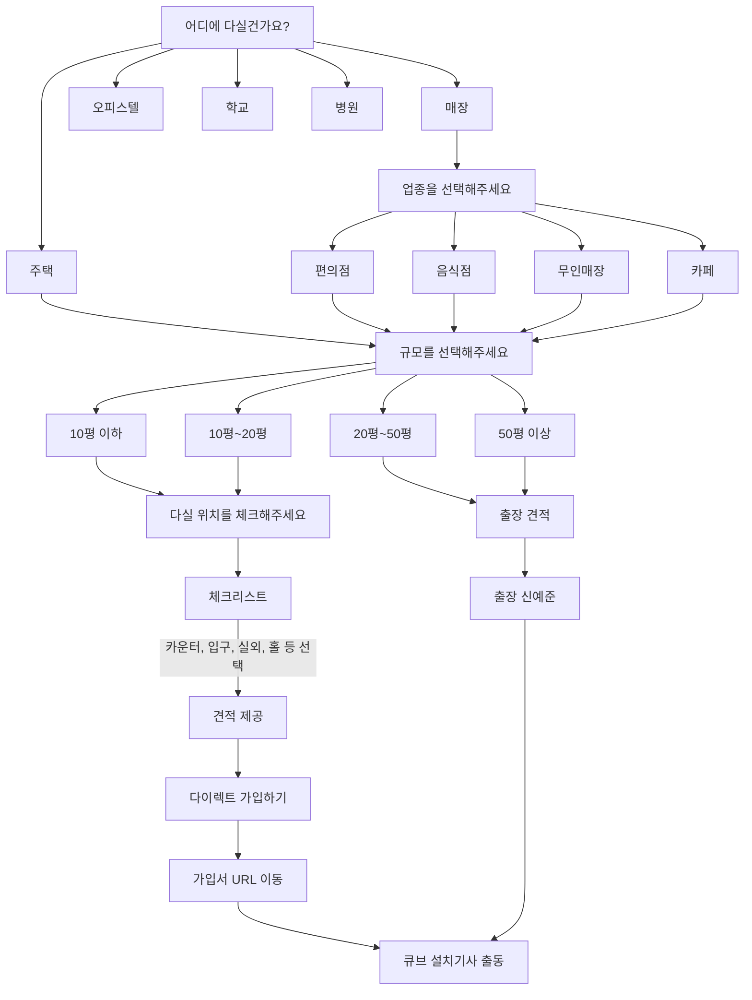

# 케어온 CCTV 무료견적 고객여정 플로우차트

## 프로세스 설명

1. **설치 장소 선택**
   - 주택, 매장, 오피스텔, 학교, 병원 중 선택

2. **업종 선택** (매장 선택 시)
   - 편의점, 음식점, 무인매장, 카페 중 선택
   - 없는 경우 기타에 자유롭게 입력 가능
   - AI가 맞춤 견적 제공

3. **규모 선택**
   - 10평 이하, 10평~20평, 20평~50평, 50평 이상 중 선택

4. **설치 위치 체크**
   - 카운터, 입구, 실외, 홀 등 필요한 위치 체크
   - 실외 특수 케이스는 별도 입력 가능
   - 체크 결과에 따라 실내/실외 카메라 수와 견적가 산정

5. **가입 방식 선택**
   - **다이렉트 가입** (최저가)
     - 작은 규모(10평~20평 이하)에 적합
     - 온라인으로 바로 가입 완료 및 설치 예약
   
   - **출장 견적**
     - 큰 규모(20평~50평 이상)에 적합
     - 전문가(신예준) 출장 방문하여 상세 견적 제공

6. **설치 진행**
   - 큐브 설치기사 출동하여 CCTV 설치